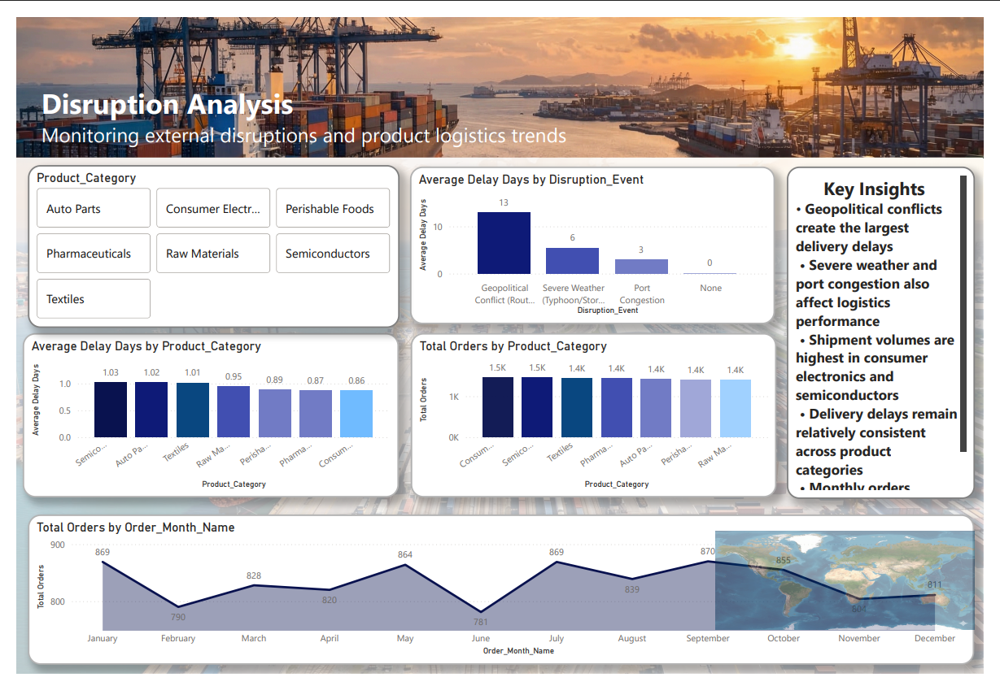
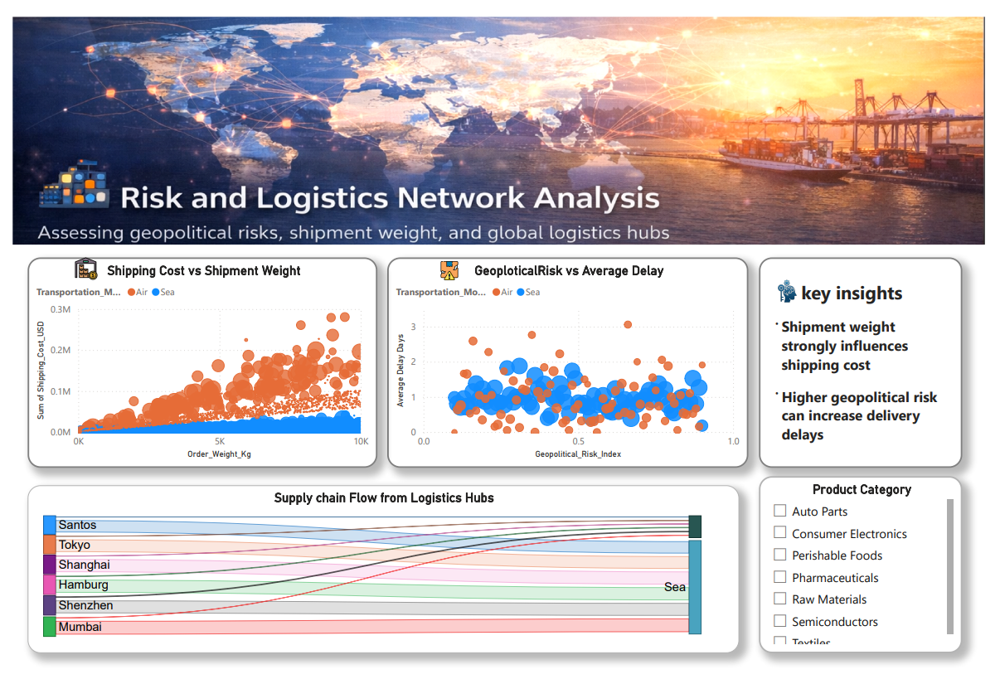

# 🌍 Global Supply Chain Disruption & Logistics Dashboard

An interactive **Power BI analytics project** exploring global shipment data to understand how **transportation modes, geopolitical risks, and disruptions impact delivery delays and shipping costs**.

This project demonstrates **data cleaning, DAX analysis, and dashboard storytelling** using Power BI.


---

## 📊 Dashboard Pages

### Page 1 — Transportation Overview

> KPI metrics, shipping cost by transport mode, delay comparison, world map of origin cities and key observations panel

---

### Page 2 — Disruption Analysis

> Geopolitical conflict delays, product category breakdown, monthly order trends and supply chain disruption impact

---

### Page 3 — Risk & Logistics Network Analysis

> Scatter plots for shipping cost vs weight, geopolitical risk vs delay, and Sankey chart showing supply chain flow from logistics hubs

---

## 🔢 Key Metrics

| Metric | Value |
|--------|-------|
| Total Orders | 10,000 |
| Total Shipping Cost | $114.38M |
| Average Delivery Delay | 0.95 days |
| On-Time Delivery Rate | 87.10% |
| Largest delay cause | Geopolitical conflict (13 days) |
| Highest shipping cost mode | Air ($82M) |

---

## 🔍 Key Insights

**Transportation:**
- Air transport costs **$82M** vs Sea at **$33M** — air is 2.5x more expensive
- Sea freight handles **8,300 orders** vs Air at **1,700** — sea dominates volume
- Air transport achieves slightly faster delivery (0.92 days vs 0.95 days for sea)

**Disruptions:**
- Geopolitical conflicts create the largest delays — **13 days average**
- Severe weather adds **6 days** of delay
- Port congestion adds **3 days** of delay
- No disruption = **0 delay days**

**Products:**
- Consumer Electronics and Semiconductors have the highest shipment volumes (~1,500 each)
- Semiconductors have the highest average delay (1.03 days)
- Consumer Electronics have the lowest delay (0.86 days)

**Risk & Cost:**
- Shipment weight shows **strong positive correlation** with shipping cost
- Higher geopolitical risk index correlates with increased delivery delays
- Santos, Tokyo and Shanghai are the busiest logistics hubs

---

## 🧭 Dashboard Pages Explained

### Page 1 — Transportation Performance
Analyse how different transportation modes impact logistics operations:
- Shipping cost distribution across Air vs Sea
- Delay comparison between transport modes
- Shipment volume by transportation method
- Global map of shipment origin cities

### Page 2 — Disruption Analysis
Understand how external disruptions affect delivery performance:
- Average delay days by disruption event type
- Product category volume and delay comparison
- Monthly order trend across 12 months
- Key insights panel with business conclusions

### Page 3 — Risk & Logistics Network
Advanced analytical visuals:
- **Scatter plot** — Shipping Cost vs Order Weight (coloured by Air/Sea)
- **Scatter plot** — Geopolitical Risk Index vs Average Delay Days
- **Sankey chart** — Supply chain flow from 6 global logistics hubs to transport modes

---

## 🛠 Tools & Technologies

| Tool | Purpose |
|------|---------|
| Power BI Desktop | Dashboard creation and visualisation |
| Power Query | Data cleaning and transformation |
| DAX | Calculated measures and KPIs |
| GitHub | Version control and documentation |

---

## 📁 Project Structure

```
global-supply-chain-logistics-dashboard/
│
├── Data/
│   └── global_supply_chain_disruption_v1.csv
│
├── DashBoard/
│   └── supply_chain_dashboard.pbix
│
├── images/
│   ├── page1.png    ← Transportation overview
│   ├── page2.png    ← Disruption analysis
│   └── page3.png    ← Risk & logistics network
│
└── README.md
```

---

## 🎯 Project Goals

This project was created to:
- Practice **end-to-end data analysis** with a real-world supply chain dataset
- Build a **3-page professional Power BI dashboard** with consistent design
- Demonstrate **DAX calculations** for KPIs and analytical measures
- Apply **data storytelling** — each page tells a focused business story
- Showcase analytics work in a **portfolio-ready format**

---

## 📌 How to Run

1. Clone this repository
2. Open `DashBoard/supply_chain_dashboard.pbix` in Power BI Desktop
3. If data doesn't load, update the data source path to point to `Data/global_supply_chain_disruption_v1.csv`
4. Refresh the data and explore the dashboard

---

*Built with Power BI · April 2026*

⭐ If you found this project helpful, consider giving the repository a star!
